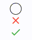
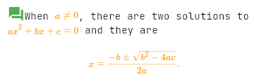
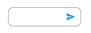
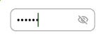
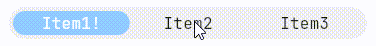
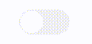
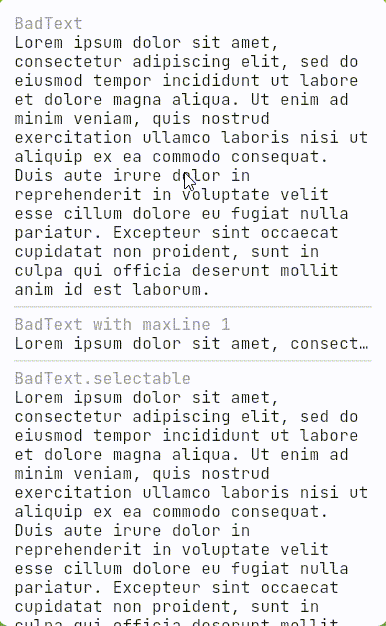
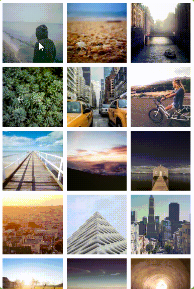
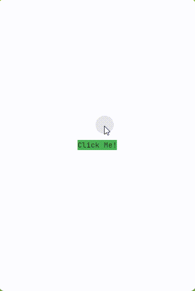
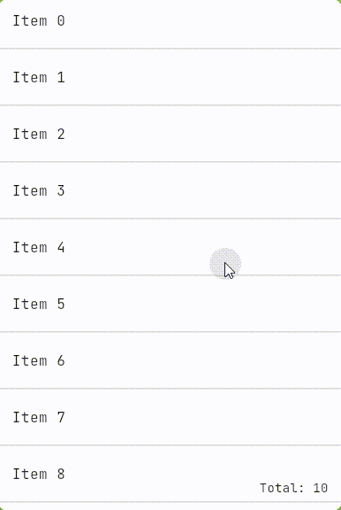

# BadFL

[](https://github.com/badlopo/bad_fl)

A flutter package, including components, implementations, helper functions and extensions. Designed to provide a simple
way to develop with flutter.

## Overview

The [`bad_fl`](https://pub.dev/packages/bad_fl) expresses component properties in a form closer to CSS representation,
making it easier for web developers to get started.

**NOTE:** This library **completely** abandons semantics! (For example, `Container`+`GestureDetector` is used to
express a `Button` rather than build-in ones) People who have related needs or care about this should use it with
caution.

## Usage

### Extension

Extension methods of built-in types, named in the form of `<Type>Ext`.

#### ListExt

[source code](./lib/extension/list.dart)

👉 `slotted`: build a new element from each element of the list and insert slot elements between every two elements.

```dart
class Example extends StatelessWidget {
  const Example({super.key});

  @override
  Widget build(BuildContext context) {
    return Scaffold(
      body: Column(
        children: const [
          Text('item1'),
          Text('item2'),
          Text('item3'),
          Text('item4'),
        ].slotted(
          builder: (v) => v,
          slot: const Divider(),
        ),
      ),
    );
  }
}
```

### Fragment

Fragment is a large section of content on the interface.

#### BadWebviewFragment

[source code](./lib/fragment/webview.dart)

```dart
class Example extends StatefulWidget {
  const Example({super.key});

  @override
  State<StatefulWidget> createState() => ExampleState();
}

class ExampleState extends State<Example> {
  final refresher = Refresher();
  double progress = 0.0;

  @override
  Widget build(BuildContext context) {
    return Scaffold(
      appBar: AppBar(
        title: const BadText('Example'),
        actions: [
          IconButton(
            icon: const Icon(Icons.refresh),
            onPressed: refresher.refresh,
          ),
        ],
      ),
      body: Column(
        children: [
          LinearProgressIndicator(value: progress),
          BadWebviewFragment.remote(
            onProgress: (v) => setState(() => progress = v),
            uri: Uri.parse('https://example.com/'),
          )
        ],
      ),
    );
  }
}
```

### Helper

#### BadDebouncer

[source code](./lib/helper/debounce.dart)

```dart
void main() async {
  final debouncer = BadDebouncer(
    delay: const Duration(seconds: 1),
    defaultAction: () {
      print('default action');
    },
  );

  // 1. call the default action
  debouncer();

  // 2. call with a custom action
  await Future.delayed(const Duration(seconds: 2));
  debouncer.call(() {
    print('wrong action');
  });

  // 3. cancel the current delayed call
  debouncer.cancel();
  debouncer(() {
    print('correct action');
  });
}

// Output:
// default action
// correct action
```

#### BadThrottler

[source code](./lib/helper/throttle.dart)

```dart
void main() async {
  final throttler = BadThrottler(defaultAction: () async {
    await Future.delayed(const Duration(milliseconds: 500));
    print('default action');
  });

  // call the default action
  throttler();

  // this call will be ignored
  throttler(() async {
    print('hello');
  });

  // call with a custom action
  await Future.delayed(const Duration(seconds: 1));
  throttler(() async {
    print('hello again');
  });
}

// Output:
// default action
// hello again
```

### Impl

These classes are fully annotated, please refer to [source code](./lib/impl) for more details.

Some classes need to be initialized before use. Due to privacy issues, some initialization have to be done after the
user has accepted the privacy policy.

- `prepare`: can be called as soon as possible
- `extend`: may only be called after the privacy policy has been accepted

| Class              | `prepare` | `extend` |
|--------------------|-----------|----------|
| `CacheImpl`        | ✅         | ❌        |
| `ClipboardImpl`    | ❌         | ❌        |
| `EvCenterImpl`     | ❌         | ❌        |
| `ExternalLinkImpl` | ❌         | ❌        |
| `ImageOPImpl`      | ❌         | ❌        |
| `KVStorageImpl`    | ✅         | ❌        |
| `MetaImpl`         | ✅         | ✅        |
| `RequestImpl`      | ❌         | ❌        |

### Layout

⏳ WIP

### Mixin

⏳ WIP

### Prefab

#### BadButton

[source code](./lib/prefab/button.dart)

| Property       | Type           | Default | Description                    |
|----------------|----------------|---------|--------------------------------|
| `width`        | `double?`      | -       | width of the button            |
| `height`       | `double`       | -       | height of the button           |
| `margin`       | `EdgeInsets?`  | -       | margin of the button           |
| `padding`      | `EdgeInsets?`  | -       | padding of the button          |
| `border`       | `Border?`      | -       | border of the button           |
| `borderRadius` | `double`       | `0`     | border radius of the button    |
| `fill`         | `Color?`       | -       | background color of the button |
| `child`        | `Widget`       | -       | child widget of the button     |
| `onClick`      | `VoidCallback` | -       | click callback of the button   |

#### BadCheckbox

[source code](./lib/prefab/checkbox.dart)

| Property      | Type                    | Default | Description                                                                               |
|---------------|-------------------------|---------|-------------------------------------------------------------------------------------------|
| `size`        | `double`                | -       | The size of the checkbox                                                                  |
| `icon`        | `Widget?`               | -       | The icon of the checkbox (Available when constructed using `BadCheckBox.icon`)            |
| `iconBuilder` | `Widget Function(bool)` | -       | The icon builder of the checkbox (Available when constructed using `BadCheckBox.builder`) |
| `iconSize`    | `double`                | `size`  | The size of the icon                                                                      |
| `border`      | `Border?`               | -       | The border of the checkbox                                                                |
| `rounded`     | `bool`                  | `true`  | Whether the checkbox is rounded                                                           |
| `fill`        | `Color?`                | -       | The background color of the checkbox when unchecked                                       |
| `fillChecked` | `Color?`                | `fill`  | The background color of the checkbox when checked                                         |
| `checked`     | `bool`                  | -       | Whether the checkbox is checked                                                           |
| `onTap`       | `VoidCallback`          | -       | The tap callback of the checkbox                                                          |

There are two ways to construct a `BadCheckbox`:

- `BadCheckbox.icon`: Use a fixed icon, the icon will be displayed when the checkbox is **checked**. This is the regular
  checkbox usage.
- `BadCheckbox.builder`: Use a custom icon builder. The builder will be called every time the check state changes and
  get the icon that should be displayed currently (if the result is null, the icon will not be displayed).

You can easily create a checkbox with multiple states using the `BadCheckbox.builder` (a checkbox with three states is
demonstrated in Example 3)



```dart
class Example extends StatefulWidget {
  const Example({super.key});

  @override
  State<Example> createState() => _ExampleState();
}

class _ExampleState extends State<Example> {
  bool _v1 = false;
  bool _v2 = false;
  int _count = 0;

  @override
  Widget build(BuildContext context) {
    return Scaffold(
      body: ListView(
        padding: const EdgeInsets.all(16),
        children: [
          // Example 1: Regular Checkbox
          BadCheckBox.icon(
            size: 24,
            icon: const Icon(Icons.check, size: 18),
            checked: _v1,
            border: Border.all(),
            onTap: () {
              setState(() {
                _v1 = !_v1;
              });
            },
          ),
          // Example 2: Custom Icon Builder
          BadCheckBox.iconBuilder(
            size: 24,
            iconBuilder: (c) {
              return c
                  ? const Icon(
                Icons.check,
                color: Colors.green,
              )
                  : const Icon(
                Icons.close,
                color: Colors.red,
              );
            },
            checked: _v2,
            onTap: () {
              setState(() {
                _v2 = !_v2;
              });
            },
          ),
          // Example 3: Multiple States (3 states)
          BadCheckBox.iconBuilder(
            size: 24,
            iconBuilder: (c) {
              return c
                  ? const Icon(
                Icons.check,
                color: Colors.green,
              )
                  : _count % 3 == 1
                  ? const Icon(
                Icons.close,
                color: Colors.red,
              )
                  : const Icon(
                Icons.remove,
                color: Colors.blue,
              );
            },
            checked: _count % 3 == 0,
            onTap: () {
              setState(() {
                _count += 1;
              });
            },
          ),
        ],
      ),
    );
  }
}
```

#### BadKatex

[source code](./lib/prefab/katex.dart)

| Property       | Type                | Default                                                                           | Description                                                    |
|----------------|---------------------|-----------------------------------------------------------------------------------|----------------------------------------------------------------|
| `raw`          | `String`            | -                                                                                 | The raw string containing the formula (wrapped by `$` or `$$`) |
| `prefixes`     | `List<InlineSpan>?` | -                                                                                 | The prefix of the paragraph (e.g. icon)                        |
| `style`        | `TextStyle?`        | -                                                                                 | The style of the paragraph                                     |
| `formulaStyle` | `TextStyle?`        | -                                                                                 | The style of the formula (will be merged with `style`)         |
| `maxLines`     | `int?`              | -                                                                                 | The maximum number of lines                                    |
| `overflow`     | `TextOverflow?`     | - `null` if `maxLines` is null<br/>- `TextOverflow.ellipsis` if `maxLines` is set | The overflow style of the paragraph                            |

It is a wrapper of [flutter_math_fork](https://pub.dev/packages/flutter_math_fork). You can directly pass in the
paragraph containing the formula as a raw string, and the formula will be automatically found and rendered.

- Use `$` to wrap inline formulas in the paragraph
- Use `$$` to wrap block formulas in the paragraph
- The `\unicode{<code>}` directive has been converted (not supported by `flutter_math_fork`)



```dart
class Example extends StatelessWidget {
  final String raw = r'''
When $a \ne 0$, there are two solutions to $ax^2 + bx + c = 0$ and they are
$$x = {-b \pm \sqrt{b^2-4ac} \over 2a}.$$
''';

  const Example({super.key});

  @override
  Widget build(BuildContext context) {
    return Scaffold(
      body: Column(
        children: [
          BadKatex(
            raw: raw,
            prefixes: const [
              WidgetSpan(
                child: Icon(Icons.question_answer, color: Colors.green),
              ),
            ],
            formulaStyle: const TextStyle(color: Colors.orange),
          ),
        ],
      ),
    );
  }
}
```

#### BadOTPInput

[source code](./lib/prefab/otp_input.dart)

| Property           | Type                        | Default                                          | Description                                                              |
|--------------------|-----------------------------|--------------------------------------------------|--------------------------------------------------------------------------|
| `width`            | `double?`                   | -                                                | width of the input                                                       |
| `height`           | `double`                    | -                                                | height of the input                                                      |
| `placeholder`      | `String?`                   | -                                                | placeholder of the input                                                 |
| `onChanged`        | `ValueChanged<String>?`     | -                                                | callback when the value changes                                          |
| `onSubmitted`      | `ValueSetter<String>?`      | -                                                | callback when the user submits the input                                 |
| `inputType`        | `TextInputType`             | `TextInputType.text`                             | input type of the input                                                  |
| `textInputAction`  | `TextInputAction`           | `TextInputAction.done`                           | action button on mobile keyboard                                         |
| `formatters`       | `List<TextInputFormatter>?` | -                                                | formatters to restrict input                                             |
| `style`            | `TextStyle?`                | -                                                | style of the input                                                       |
| `placeholderStyle` | `TextStyle?`                | -                                                | style of the placeholder                                                 |
| `padding`          | `double`                    | `8`                                              | space between `prefixWidget`/`sendWidget` and outside of the input field |
| `space`            | `double`                    | `8`                                              | space between `prefixWidget`/`sendWidget` and text of the input field    |
| `fill`             | `Color?`                    | -                                                | background color of the input                                            |
| `border`           | `Border?`                   | -                                                | border of the input                                                      |
| `borderRadius`     | `double`                    | `0`                                              | border radius of the input                                               |
| `prefixWidget`     | `Widget?`                   | -                                                | widget to display before the input field                                 |
| `sendWidget`       | `Widget`                    | `Icon(Icons.send, size: 16, color: Colors.blue)` | widget to display as role of send button                                 |
| `onSendTapped`     | `VoidCallback`              | -                                                | callback when the `sendWidget` is tapped                                 |



```dart
class Example extends StatelessWidget {
  const Example({super.key});

  @override
  Widget build(BuildContext context) {
    return Scaffold(
      body: Column(
        children: [
          BadOTPInput(
            width: 120,
            height: 32,
            border: Border.all(color: Colors.grey),
            borderRadius: 8,
            onSendTapped: () {
              print('send tapped');
            },
            onSubmitted: (code) {
              print('submitted: $code');
            },
          ),
        ],
      ),
    );
  }
}
```

#### BadPasswordInput

[source code](./lib/prefab/password_input.dart)

| Property              | Type                        | Default                                                             | Description                                                              |
|-----------------------|-----------------------------|---------------------------------------------------------------------|--------------------------------------------------------------------------|
| `width`               | `double?`                   | -                                                                   | width of the input                                                       |
| `height`              | `double`                    | -                                                                   | height of the input                                                      |
| `initialVisibility`   | `bool`                      | `false`                                                             | initial visibility of the password                                       |
| `placeholder`         | `String?`                   | -                                                                   | placeholder of the input                                                 |
| `onVisibilityChanged` | `ValueChanged<bool>?`       | -                                                                   | visibility change callback                                               |
| `onChanged`           | `ValueChanged<String>?`     | -                                                                   | callback when the value changes                                          |
| `onSubmitted`         | `ValueSetter<String>?`      | -                                                                   | callback when the user submits the input                                 |
| `textInputAction`     | `TextInputAction`           | `TextInputAction.done`                                              | action button on mobile keyboard                                         |
| `formatters`          | `List<TextInputFormatter>?` | -                                                                   | formatters to restrict input                                             |
| `style`               | `TextStyle?`                | -                                                                   | style of the input                                                       |
| `placeholderStyle`    | `TextStyle?`                | -                                                                   | style of the placeholder                                                 |
| `padding`             | `double`                    | `8`                                                                 | space between `prefixWidget`/`sendWidget` and outside of the input field |
| `space`               | `double`                    | `8`                                                                 | space between `prefixWidget`/`sendWidget` and text of the input field    |
| `fill`                | `Color?`                    | -                                                                   | background color of the input                                            |
| `border`              | `Border?`                   | -                                                                   | border of the input                                                      |
| `borderRadius`        | `double`                    | `0`                                                                 | border radius of the input                                               |
| `prefixWidget`        | `Widget?`                   | -                                                                   | widget to display before the input field                                 |
| `suffixWidget`        | `Widget`                    | -                                                                   | widget to display after the input field                                  |
| `visibleWidget`       | `Widget`                    | `Icon(Icons.visibility_outlined, size: 16, color: Colors.grey)`     | widget to display when the password is visible                           |
| `hiddenWidget`        | `Widget`                    | `Icon(Icons.visibility_off_outlined, size: 16, color: Colors.grey)` | widget to display when the password is hidden                            |



```dart
class Example extends StatelessWidget {
  const Example({super.key});

  @override
  Widget build(BuildContext context) {
    return Scaffold(
      body: Column(
        children: [
          BadPasswordInput(
            width: 120,
            height: 32,
            border: Border.all(color: Colors.grey),
            borderRadius: 8,
            onVisibilityChanged: (to) {
              print('visibility: $to');
            },
            onSubmitted: (code) {
              print('submitted: $code');
            },
          ),
        ],
      ),
    );
  }
}
```

#### BadRadio

[source code](./lib/prefab/radio.dart)

| Property             | Type                                    | Default | Description                                                                                |
|----------------------|-----------------------------------------|---------|--------------------------------------------------------------------------------------------|
| `activeIndex`        | `int`                                   | -       | index of the active item                                                                   |
| `onTap`              | `ValueChanged<int>`                     | -       | callback when the item is tapped (won't be called if the active item is tapped)            |
| `width`              | `double?`                               | -       | width of the radio group                                                                   |
| `height`             | `double`                                | -       | height of the radio group                                                                  |
| `padding`            | `EdgeInsets`                            | -       | space between content and outside of the radio group                                       |
| `border`             | `Border?`                               | -       | border of the radio group                                                                  |
| `borderRadius`       | `double`                                | `0`     | border radius of the radio group                                                           |
| `fill`               | `Color?`                                | -       | background color of the radio group                                                        |
| `gradient`           | `Gradient?`                             | -       | background gradient of the radio group (`fill` will be ignored if this is specified)       |
| `activeFill`         | `Color?`                                | -       | background color of the active item                                                        |
| `activeGradient`     | `Gradient?`                             | -       | background gradient of the active item (`activeFill` will be ignored if this is specified) |
| `values`             | `List<Item>` (`Item` is a generic type) | -       | values of the radio group                                                                  |
| `childBuilder`       | `Widget Function(Item)`                 | -       | builder for each item                                                                      |
| `activeChildBuilder` | `Widget Function(Item)?`                | -       | builder for the active item, if not specified, `childBuilder` will be used                 |



```dart
class Example extends StatefulWidget {
  const Example({super.key});

  @override
  State<Example> createState() => _ExampleState();
}

class _ExampleState extends State<Example> {
  int activeIndex = 0;

  @override
  Widget build(BuildContext context) {
    return Scaffold(
      body: Column(
        children: [
          BadRadio(
            activeIndex: activeIndex,
            onTap: (int to) {
              setState(() {
                activeIndex = to;
              });
              print('tapped $to');
            },
            height: 32,
            borderRadius: 16,
            fill: Colors.grey[200],
            activeFill: Colors.blue[200],
            values: const ['Item1', 'Item2', 'Item3'],
            childBuilder: (label) => BadText(label),
            activeChildBuilder: (label) {
              return BadText('$label!', color: Colors.white);
            },
          ),
        ],
      ),
    );
  }
}
```

#### BadSwitch

[source code](./lib/prefab/switch.dart)

| Property            | Type           | Default        | Description                                              |
|---------------------|----------------|----------------|----------------------------------------------------------|
| `active`            | `bool`         | -              | whether the switch is active                             |
| `onTap`             | `VoidCallback` | -              | callback when the switch is tapped                       |
| `width`             | `double`       | -              | width of the switch                                      |
| `height`            | `double`       | -              | height of the switch                                     |
| `gap`               | `double`       | `1`            | gap between the track and the handle, in `[0, height/2)` |
| `handleColor`       | `Color`        | `Colors.white` | color of the handle                                      |
| `handleColorActive` | `Color`        | `Colors.white` | color of the handle when active                          |
| `trackColor`        | `Color`        | `Colors.grey`  | color of the track                                       |
| `trackColorActive`  | `Color`        | `Colors.blue`  | color of the track when active                           |



```dart
class Example extends StatefulWidget {
  const Example({super.key});

  @override
  State<Example> createState() => _ExampleState();
}

class _ExampleState extends State<Example> {
  bool active = false;

  @override
  Widget build(BuildContext context) {
    return Scaffold(
      body: Column(
        children: [
          BadSwitch(
            width: 64,
            height: 32,
            gap: 2,
            active: active,
            handleColorActive: Colors.orange,
            trackColor: Colors.grey[200]!,
            trackColorActive: Colors.orange[200]!,
            onTap: () {
              setState(() {
                active = !active;
              });
              print('active: $active');
            },
          ),
        ],
      ),
    );
  }
}
```

#### BadText

[source code](./lib/prefab/text.dart)

| Property        | Type            | Default                                                       | Description                                                   |
|-----------------|-----------------|---------------------------------------------------------------|---------------------------------------------------------------|
| `text`          | `String`        | -                                                             | text content                                                  |
| `fontFamily`    | `String?`       | -                                                             | font family                                                   |
| `selectable`    | `bool`          | - `false` for `BadText`<br/>- `true` for `BadText.selectable` | whether the text is selectable                                |
| `color`         | `Color?`        | -                                                             | text color                                                    |
| `fontSize`      | `double`        | `16`                                                          | font size                                                     |
| `fontWeight`    | `FontWeight`    | `FontWeight.w400`                                             | font weight                                                   |
| `lineHeight`    | `double`        | `fontSize * 1.2`                                              | line height                                                   |
| `underline`     | `bool`          | `false`                                                       | whether the text is underlined                                |
| `italic`        | `bool`          | `false`                                                       | whether the text is italic                                    |
| `shadows`       | `List<Shadow>?` | -                                                             | shadows of the text                                           |
| `textAlign`     | `TextAlign`     | `TextAlign.start`                                             | text alignment                                                |
| `textDirection` | `TextDirection` | `TextDirection.ltr`                                           | text direction                                                |
| `overflow`      | `TextOverflow?` | -                                                             | text overflow style (does not work with `BadText.selectable`) |
| `maxLines`      | `int?`          | -                                                             | maximum number of lines                                       |



```dart

const lorem =
    'Lorem ipsum dolor sit amet, consectetur adipiscing elit, sed do eiusmod tempor incididunt ut labore et dolore magna aliqua. Ut enim ad minim veniam, quis nostrud exercitation ullamco laboris nisi ut aliquip ex ea commodo consequat. Duis aute irure dolor in reprehenderit in voluptate velit esse cillum dolore eu fugiat nulla pariatur. Excepteur sint occaecat cupidatat non proident, sunt in culpa qui officia deserunt mollit anim id est laborum.';

class Example extends StatelessWidget {
  final RxInt activeIndex = 0.obs;

  Example({super.key});

  @override
  Widget build(BuildContext context) {
    return Scaffold(
      body: ListView(
        padding: const EdgeInsets.all(16),
        children: const [
          BadText('BadText', color: Colors.grey),
          BadText(lorem),
          Divider(),
          BadText('BadText with maxLine 1', color: Colors.grey),
          BadText(lorem, maxLines: 1),
          Divider(),
          BadText('BadText.selectable', color: Colors.grey),
          BadText.selectable(lorem),
          Divider(),
          BadText('BadText.selectable with maxLine 1', color: Colors.grey),
          BadText.selectable(lorem, maxLines: 1),
        ],
      ),
    );
  }
}
```

#### BadTextField

[source code](./lib/prefab/text_field.dart)

TODO: Properties
TODO: Screenshot
TODO: Example

#### BadTextInput

[source code](./lib/prefab/text_input.dart)

TODO: Properties
TODO: Screenshot
TODO: Example

### Wrapper

Non-visual components that wrap other components.

#### BadClickable

[source code](./lib/wrapper/clickable.dart)

Add click event listener for the widget.

```dart
class Example extends StatelessWidget {
  const Example({super.key});

  @override
  Widget build(BuildContext context) {
    return Scaffold(
      body: BadClickable(
        onClick: () => print('clicked'),
        child: Container(width: 100, height: 100, color: Colors.blue),
      ),
    );
  }
}
```

#### BadHeroPreviewer

[source code](./lib/wrapper/hero_previewer.dart)

Provide a preview view for the component, with hero animation when opening the preview view.

- image preview:



```dart
class Example extends StatelessWidget {
  const Example({super.key});

  @override
  Widget build(BuildContext context) {
    return Scaffold(
      body: GridView.builder(
        padding: const EdgeInsets.all(8),
        gridDelegate: const SliverGridDelegateWithFixedCrossAxisCount(
          mainAxisSpacing: 8,
          crossAxisSpacing: 8,
          crossAxisCount: 3,
        ),
        itemCount: 15,
        itemBuilder: (_, int index) {
          return BadHeroPreviewer(
            displayWidget: Image.network(
              'https://picsum.photos/seed/num-$index/200',
              width: 50,
            ),
          );
        },
      ),
    );
  }
}
```

- custom widget:



```dart
class Example extends StatelessWidget {
  const Example({super.key});

  @override
  Widget build(BuildContext context) {
    return Scaffold(
      body: Center(
        child: BadHeroPreviewer(
          displayWidget: Container(
            color: Colors.green,
            child: const Text('Click Me!'),
          ),
          previewWidget: Container(
            color: Colors.orange,
            alignment: Alignment.center,
            child: const Text(
              'Wow!\nYou clicked me!',
              style: TextStyle(
                color: Colors.white,
                fontSize: 32,
                fontWeight: FontWeight.w800,
              ),
            ),
          ),
        ),
      ),
    );
  }
}
```

#### BadRefreshable

[source code](./lib/wrapper/refreshable.dart)

A simple encapsulation of [easy_refresh](https://pub.dev/packages/easy_refresh), providing pull-down refresh and pull-up
loading.



```dart
class Example extends StatefulWidget {
  const Example({super.key});

  @override
  State<Example> createState() => _ExampleState();
}

class _ExampleState extends State<Example> {
  int _count = 10;

  Future<void> refresh() async {
    await Future<void>.delayed(const Duration(seconds: 1));
    setState(() {
      _count = 10;
    });
  }

  Future<void> fetch() async {
    await Future<void>.delayed(const Duration(seconds: 1));
    setState(() {
      _count += 10;
    });
  }

  @override
  Widget build(BuildContext context) {
    return Scaffold(
      floatingActionButton: Text('Total: $_count'),
      body: BadRefreshable(
        onRefresh: refresh,
        onLoadMore: fetch,
        child: ListView.separated(
          itemCount: _count,
          itemBuilder: (_, int index) {
            return ListTile(title: Text('Item $index'));
          },
          separatorBuilder: (_, __) => const Divider(),
        ),
      ),
    );
  }
}
```

## Useful Tips

- When using input components, do not use `borderRadius` and non-fully enclosed `border` at the same time. (will result
  in unexpected lines at the rounded corners)